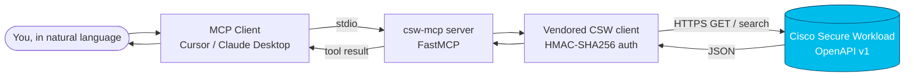

<div align="center">

# csw-mcp

**Query Cisco Secure Workload in natural language — a read-only MCP server for Cursor & Claude Desktop.**

[](LICENSE)
[](https://www.python.org/)
[](https://modelcontextprotocol.io)
[](#safety--design-principles)
[](https://astral.sh/uv)

*Ask “how many agents are enforcing policy?” or “which hosts have exploitable critical CVEs?” — and get an answer, not an API call.*

</div>

---

## What it is

`csw-mcp` is a [Model Context Protocol](https://modelcontextprotocol.io) server
that lets MCP clients (Cursor, Claude Desktop, …) query a **Cisco Secure Workload
(CSW / Tetration)** cluster in plain English. It's built for Cisco SEs / TMEs
running CSW proofs-of-value who want fast posture answers without hand-writing
HMAC-signed API calls.



> **Read-only by design.** No tool creates, updates, or deletes anything on the
> cluster. Transport is **stdio only** — there is no network listener.

---

## Quickstart

```bash
# 1. Enter the repo
cd csw-mcp

# 2. Create the environment and install (uv — https://astral.sh/uv)
uv venv
uv pip install -e .

# 3. Configure credentials
cp .env.example .env            # then edit with your cluster URL / key / secret

# 4. Register with Cursor (idempotent)
bash scripts/install-cursor.sh

# 5. Restart Cursor, then ask: "Summarize my CSW cluster posture."
```

Verify it loaded:

```bash
uv run python -c "from csw_mcp.server import mcp; print('tools:', len(mcp._tool_manager._tools), 'prompts:', len(mcp._prompt_manager._prompts))"
# tools: 15 prompts: 3

# Optional: smoke-test every tool against your own cluster
uv run python tests/test_tools_live.py
```

Full step-by-step with screenshots-as-ascii: **[docs/INSTALL.md](docs/INSTALL.md)**.

---

## Capabilities

### Tools (15)

| Name | What it does |
|------|--------------|
| `list_scopes` | List the scope hierarchy (`GET /openapi/v1/app_scopes`) |
| `list_sensors` | List agents/sensors (uuid, hostname, agent_type, platform, IPs) |
| `search_inventory` | Search inventory by field/value filter |
| `get_workload` | Fetch one workload's inventory record by IP |
| `summarize_cluster_posture` | Headline posture KPIs (enforcement coverage, agents by type) |
| `list_workspaces` | List application workspaces (policy folders / ADM scopes) |
| `get_workspace_policies` | List policies defined in a workspace |
| `list_policies_for_workload` | List policies currently applied to a workload |
| `search_flows` | Search network flows over a recent time window |
| `get_conversations` | List ADM conversations (talker pairs) for a workspace |
| `top_risky_flows` | Rank risky-service exposure (RDP/SMB/telnet/DB ports) |
| `get_workload_cves` | List CVEs on a workload + severity tally |
| `get_workload_packages` | List installed packages on a workload |
| `top_vulnerable_hosts` | Rank hosts by CVE severity (critical×10 + high) |
| `list_forensic_profiles` | List configured forensic profiles |

### Resources (4)

| URI | What it does |
|-----|--------------|
| `csw://cluster/info` | Cluster URL, config state, quick scope/agent counts |
| `csw://scopes` | Scope hierarchy (cached ~60s) |
| `csw://snapshots/latest` | Newest local `snapshot-*.json` (via `$CSW_POV_TEMPLATE`) |
| `csw://reports/executive-latest` | Newest local executive-summary markdown |

### Prompts (3)

`csw/triage-blast-radius` · `csw/weekly-posture-review` · `csw/pov-closeout`

See **[docs/USAGE.md](docs/USAGE.md)** for example prompts and when to use each tool.

---

## Examples

Five fully-synthetic SE walkthroughs live in **[`examples/`](examples/)**, each with
a question, the tool-call flow, and a rendered HTML deliverable:

- [`blast-radius-triage`](examples/blast-radius-triage/) — "Which hosts aren't enforcing?"
- [`executive-summary`](examples/executive-summary/) — "One-page CISO summary."
- [`cve-prioritization`](examples/cve-prioritization/) — "Exploitable + exposed CVEs?"
- [`weekly-posture-review`](examples/weekly-posture-review/) — "What changed since last week?"
- [`pov-closeout`](examples/pov-closeout/) — "Closeout + 30-day plan."

---

## Configuration

Credentials come from a project-level `.env` (never committed — see `.gitignore`):

| Variable | Required | Notes |
|----------|----------|-------|
| `CSW_API_URL` | yes | Cluster base URL, no trailing slash |
| `CSW_API_KEY` | yes | API key (hex) from CSW UI → API Keys |
| `CSW_API_SECRET` | yes | HMAC signing secret paired with the key |
| `CSW_VERIFY_SSL` | no | Set `false` only behind a TLS-inspecting proxy |
| `CSW_MCP_ENV` | no | Explicit path to an alternate env file |
| `CSW_POV_TEMPLATE` | no | Path to a CSW_POV_Template checkout (enables snapshot/report resources) |

Generate an API key in the CSW UI (**User Menu → API Keys → Create API Key**) with
read capabilities: `sensor_management`, `flow_inventory_query`, `app_policy_management`.

---

## Safety & design principles

- **Read-only.** Only GET and read-only *search* POSTs; no create/update/delete tools.
- **stdio transport.** No listening socket → no DNS-rebinding / CSRF surface.
- **Single-purpose tools.** No "run arbitrary request" escape hatch.
- **Bounded.** Result limits are clamped; aggregators cap fan-out and pagination.
- **No secrets in code.** Credentials load from a git-ignored `.env`; nothing is logged.
- **Minimal output.** Tool results are projected to the fields you need.

More detail: **[docs/ARCHITECTURE.md](docs/ARCHITECTURE.md)**.

---

## Documentation

| Doc | Contents |
|-----|----------|
| [docs/INSTALL.md](docs/INSTALL.md) | Full install, wiring, verification |
| [docs/USAGE.md](docs/USAGE.md) | Example prompts, tool selection, combining tools |
| [docs/TROUBLESHOOTING.md](docs/TROUBLESHOOTING.md) | Top 10 "it broke" fixes |
| [docs/CONTRIBUTING.md](docs/CONTRIBUTING.md) | How to add a new tool (+ test) |
| [docs/ARCHITECTURE.md](docs/ARCHITECTURE.md) | Components, modules, HMAC auth flow |

---

## Development

The CSW API client (`src/csw_mcp/vendor/csw_api.py`, `csw_helpers.py`) is
**vendored** from the generic `CSW_POV_Template` project and should not be edited
by hand. Re-sync it with:

```bash
CSW_POV_TEMPLATE=/path/to/CSW_POV_Template bash scripts/sync-vendor.sh
```

Regenerate the example reports:

```bash
python3 examples/build_examples.py
```

---

## License

[Apache-2.0](LICENSE).
