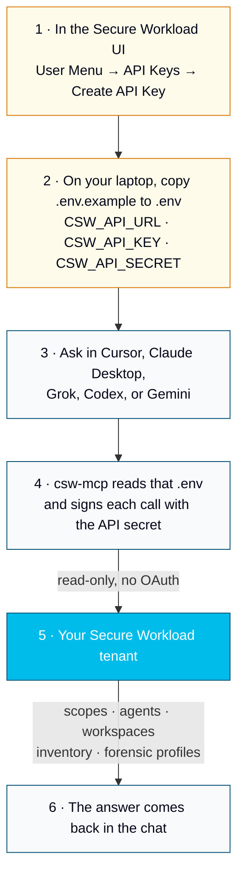

<div align="center">

# csw-mcp

**Query Cisco Secure Workload in natural language — a read-only MCP server for Cursor, Claude Desktop, Grok, Codex, and Gemini.**


[](LICENSE)
[](https://www.python.org/)
[](https://modelcontextprotocol.io)
[](#safety--design-principles)
[](https://astral.sh/uv)

*Ask “how many agents are enforcing policy?” or “which hosts have exploitable critical CVEs?” — and get an answer, not an API call.*

</div>

---

## What it is

`csw-mcp` is a [Model Context Protocol](https://modelcontextprotocol.io) server
that lets MCP clients (Cursor, Claude Desktop, Grok, Codex, and Gemini) query a **Cisco Secure Workload
(CSW / Tetration)** cluster in plain English. It is for anyone who wants to
use CSW and get posture answers without writing HMAC-signed API calls.



**Where the cluster info goes:** a file named `.env` in this repo (it stays on your machine and is never committed). No OAuth, no browser login, and no extra token service. Secure Workload uses an API key plus its matching secret. Create that pair in the product UI under **User Menu → API Keys → Create API Key**, then put these three lines in `.env`:

```bash
CSW_API_URL=https://your-cluster.tetrationcloud.com
CSW_API_KEY=your_api_key_here
CSW_API_SECRET=your_api_secret_here
```

`CSW_API_URL` is the cluster address only, with no path on the end. The key needs read access for sensors, flows, and policy. Setup steps are in [docs/INSTALL.md](docs/INSTALL.md).

Start with one of these. They are the [current capabilities](#current-capabilities) confirmed on a live tenant:

- “Show me the scope tree.”
- “List the agents on this cluster.”
- “What workspaces are defined?”
- “Find the workload for this IP.”
- “Which forensic profiles are on this cluster?”

The server only reads. It does not create, change, or delete anything on the tenant, and it listens only on a local stdio pipe. If a read does not come back the first time, the server waits briefly and tries again a few times so the data still arrives. The HMAC signing and module layout are in [docs/ARCHITECTURE.md](docs/ARCHITECTURE.md).

This repo is companion tooling, **not** official Cisco documentation. Confirm
behavior against your cluster's in-product help and the
[Cisco Secure Workload product documentation](https://www.cisco.com/c/en/us/products/security/workload-security/index.html).

---

## New to Cisco Secure Workload?

Cisco Secure Workload (also called **Tetration**) watches how servers talk to
each other, then lets you write firewall-style rules that follow the *workload*
instead of a fixed IP. The goal is simple: if one machine is compromised, the
attacker should not be able to walk sideways to the next one. That is
**micro-segmentation**, and the size of the damage an attacker can do is the
**blast radius**.

You do not need to know the product to use this server. Ask a question in
English. The model calls the tools below and answers in plain language.

| Term you will see | Plain meaning |
|---|---|
| **Agent / sensor** | Software on a host that reports connections. In **enforcement** mode it also blocks traffic the policy does not allow. In **visibility** mode it only watches. |
| **Scope** | A folder in the inventory tree (for example Production, Databases, WebTier) used to group workloads and attach policy. |
| **Workspace / application** | A policy container. **ADM** (Application Dependency Mapping) looks at real traffic and proposes a starter ruleset. |
| **Flow** | One observed connection: who talked to whom, on which port, and whether policy allowed it. |
| **Conversation** | A summarized "these two groups talk on this port" pair that ADM uses to draft policy. |
| **Workload** | One host, VM, or pod that CSW is tracking. |

If you want the longer story — why this exists, how a POV is run, and a video
learning path — start with
[CSW User Education](https://github.com/chandrapati/CSW-User-Education).

---

## Quickstart

```bash
# 1. Enter the repo
cd csw-mcp

# 2. Create the environment and install (uv — https://astral.sh/uv)
uv venv
uv pip install -e .

# 3. Configure credentials
cp .env.example .env            # then edit with your cluster URL / key / secret

# 4. Register with Cursor (idempotent)
bash scripts/install-cursor.sh

# 5. Restart Cursor, then ask: "Summarize my CSW cluster posture."
```

Verify it loaded:

```bash
uv run python -c "from csw_mcp.server import mcp; print('tools:', len(mcp._tool_manager._tools), 'prompts:', len(mcp._prompt_manager._prompts))"
# tools: 20 prompts: 3

# Optional: smoke-test every tool against your own cluster
uv run python tests/test_tools_live.py
```

Full step-by-step with screenshots-as-ascii: **[docs/INSTALL.md](docs/INSTALL.md)**.

---

## Capabilities

### Tools (20)

| Name | What it does |
|------|--------------|
| `list_scopes` | List the scope hierarchy (`GET /openapi/v1/app_scopes`) |
| `list_sensors` | List agents/sensors (uuid, hostname, agent_type, platform, IPs) |
| `search_inventory` | Search inventory by field/value filter |
| `get_workload` | Fetch one workload's inventory record by IP |
| `summarize_cluster_posture` | Headline posture KPIs (enforcement coverage, agents by type) |
| `list_workspaces` | List application workspaces (policy folders / ADM scopes) |
| `get_workspace_policies` | List policies defined in a workspace |
| `list_policies_for_workload` | List policies currently applied to a workload |
| `search_flows` | Search network flows over a recent time window |
| `get_conversations` | List ADM conversations (talker pairs) for a workspace |
| `top_risky_flows` | Rank risky-service exposure (RDP/SMB/telnet/DB ports) |
| `get_workload_cves` | List CVEs on a workload + severity tally |
| `get_workload_packages` | List installed packages on a workload |
| `top_vulnerable_hosts` | Rank hosts by CVE severity (critical×10 + high) |
| `list_forensic_profiles` | List configured forensic profiles |
| `list_forensic_rules` | Forensic detection rules, with MITRE ids taken from the rule name |
| `list_forensic_intents` | Which forensic profile is bound to which agent group |
| `summarize_flows` | Policy verdicts, busiest ports, and process names in a flow sample |
| `long_lived_processes` | Processes that keep appearing across daily flow samples |
| `audit_risky_policy_ports` | ALLOW policies that open a risky management or data port |

### Resources (4)

| URI | What it does |
|-----|--------------|
| `csw://cluster/info` | Cluster URL, config state, quick scope/agent counts |
| `csw://scopes` | Scope hierarchy (cached ~60s) |
| `csw://snapshots/latest` | Newest local `snapshot-*.json` (via `$CSW_POV_TEMPLATE`) |
| `csw://reports/executive-latest` | Newest local executive-summary markdown |

### Prompts (3)

`csw/triage-blast-radius` · `csw/weekly-posture-review` · `csw/pov-closeout`

See **[docs/USAGE.md](docs/USAGE.md)** for example prompts and when to use each tool.

---

## Current capabilities

[](docs/TESTED.md)
[](docs/TESTED.md)

Confirmed on a live SaaS tenant. Each row below returned data. Full notes: **[docs/TESTED.md](docs/TESTED.md)**.

| | Feature | What you get | Try this |
|---|---|---|---|
| ✅ | `list_scopes` | The scope tree | “Show me the scope tree.” |
| ✅ | `list_sensors` | Agents, hostnames, platforms, addresses | “List the agents on this cluster.” |
| ✅ | `list_workspaces` | Application workspaces | “What workspaces are defined?” |
| ✅ | `search_inventory` | Inventory matches for an IP or field | “Find the workload for this IP.” |
| ✅ | `get_workload` | One workload record | “Show me the workload at this IP.” |
| ✅ | `list_forensic_profiles` | Configured forensic profiles | “Which forensic profiles are on this cluster?” |
| ✅ | `summarize_cluster_posture` | Agent count, scope count, and enforcement coverage | “How many agents are enforcing?” |
| ✅ | `get_workspace_policies` | Absolute and default policies for a workspace | “Show the policies in this workspace.” |
| ✅ | `search_flows` | Recent flows in a scope | “Show recent flows in the root scope.” |
| ✅ | `get_conversations` | ADM conversations for a workspace | “Show the conversations for this workspace.” |
| ✅ | `top_risky_flows` | Risky ports with recent flow activity | “Which risky ports have recent traffic?” |
| ✅ | `list_forensic_rules` | Forensic detection rules, including MITRE ids in the name | “Which forensic rules are configured?” |
| ✅ | `list_forensic_intents` | Which profile is bound to which agent group | “Which forensic profile applies where?” |
| ✅ | `summarize_flows` | Policy verdicts, busiest ports, and process names in a sample | “Summarize recent flows.” |
| ✅ | `long_lived_processes` | Processes that keep appearing across daily samples | “Which processes stay up across days?” |
| ✅ | `audit_risky_policy_ports` | ALLOW policies that open a risky port | “Which policies allow RDP or SMB?” |

---

## Examples

Five fully-synthetic walkthroughs live in **[`examples/`](examples/)**, each with
a question, the tool-call flow, and a rendered HTML deliverable:

- [`blast-radius-triage`](examples/blast-radius-triage/) — "Which hosts aren't enforcing?"
- [`executive-summary`](examples/executive-summary/) — "One-page CISO summary."
- [`cve-prioritization`](examples/cve-prioritization/) — "Exploitable + exposed CVEs?"
- [`weekly-posture-review`](examples/weekly-posture-review/) — "What changed since last week?"
- [`pov-closeout`](examples/pov-closeout/) — "Closeout + 30-day plan."

---

## Configuration

Credentials come from a project-level `.env` (never committed — see `.gitignore`):

| Variable | Required | Notes |
|----------|----------|-------|
| `CSW_API_URL` | yes | Cluster base URL, no trailing slash |
| `CSW_API_KEY` | yes | API key (hex) from CSW UI → API Keys |
| `CSW_API_SECRET` | yes | HMAC signing secret paired with the key |
| `CSW_VERIFY_SSL` | no | Set `false` only behind a TLS-inspecting proxy |
| `CSW_MCP_ENV` | no | Explicit path to an alternate env file |
| `CSW_POV_TEMPLATE` | no | Path to a CSW_POV_Template checkout (enables snapshot/report resources) |

Generate an API key in the CSW UI (**User Menu → API Keys → Create API Key**) with
read capabilities: `sensor_management`, `flow_inventory_query`, `app_policy_management`.

---

## Safety & design principles

- **Read-only.** Only GET and read-only *search* POSTs; no create/update/delete tools.
- **stdio transport.** No listening socket → no DNS-rebinding / CSRF surface.
- **Single-purpose tools.** No "run arbitrary request" escape hatch.
- **Bounded.** Result limits are clamped; aggregators cap fan-out and pagination.
- **Retries.** A read that does not come back the first time is tried again a few times, with a short wait between tries, so the data still arrives.
- **No secrets in code.** Credentials load from a git-ignored `.env`; nothing is logged.
- **Minimal output.** Tool results are projected to the fields you need.

More detail: **[docs/ARCHITECTURE.md](docs/ARCHITECTURE.md)**.

---

## Documentation

| Doc | Contents |
|-----|----------|
| [docs/INSTALL.md](docs/INSTALL.md) | Full install, wiring, verification |
| [docs/USAGE.md](docs/USAGE.md) | Example prompts, tool selection, combining tools |
| [docs/TROUBLESHOOTING.md](docs/TROUBLESHOOTING.md) | Top 10 "it broke" fixes |
| [docs/CONTRIBUTING.md](docs/CONTRIBUTING.md) | How to add a new tool (+ test) |
| [docs/ARCHITECTURE.md](docs/ARCHITECTURE.md) | Components, modules, HMAC auth flow |

---

## Development

The CSW API client (`src/csw_mcp/vendor/csw_api.py`, `csw_helpers.py`) is
**vendored** from the generic `CSW_POV_Template` project and should not be edited
by hand. Re-sync it with:

```bash
CSW_POV_TEMPLATE=/path/to/CSW_POV_Template bash scripts/sync-vendor.sh
```

Regenerate the example reports:

```bash
python3 examples/build_examples.py
```

---

## Related CSW material

Same author, public repos. Use these when you want the background, a POV plan,
or the script toolkit this server sits on top of. Customer-specific repos are
intentionally not listed here.

### Learn the product

| Repo | Use it when you want… |
|---|---|
| [CSW User Education](https://github.com/chandrapati/CSW-User-Education) | A plain-language intro, video library, and onboarding path |
| [CSW POV Playbook](https://github.com/chandrapati/CSW-POV-Playbook) | A field guide any SE can run: scope, observe, model policy, enforce safely, executive readout |
| [CSW Personas](https://github.com/chandrapati/CSW-Personas) | Who shows up in a deal, what they care about, and which CSW topics to lead with |
| [Cisco product docs](https://www.cisco.com/c/en/us/products/security/workload-security/index.html) | Official Secure Workload documentation |

### Query and report on a cluster

| Repo | How it relates to csw-mcp |
|---|---|
| [CSW Operations Toolkit](https://github.com/chandrapati/CSW-Operations-Toolkit) | The Python scripts (snapshots, flows, policies, HTML reports) whose API client this server vendors. Use the scripts for batch reports; use csw-mcp to ask questions in chat. |
| [csw-logs-check](https://github.com/chandrapati/csw-logs-check) | Reads an **agent diagnostic log bundle** (enforcement timing, policy versions) — a different input than the live API this server calls. |
| [CSW Compliance Mapping](https://github.com/chandrapati/CSW-Compliance-Mapping) | How CSW controls map to HIPAA, SOC 2, PCI DSS, NIST 800-53, ISO 27001, and related frameworks |
| [Blast radius demo](https://github.com/chandrapati/csw_blast_radius_demo) | A visual companion to the `blast-radius-triage` example in this repo |

### Install agents and connect other systems

| Repo | Topic |
|---|---|
| [Kubernetes / OpenShift agent guide](https://github.com/chandrapati/CSW-Kubernetes-OpenShift-Guide) | Install the agent on cluster nodes and enforce pod/service policy |
| [Kubernetes integration](https://github.com/chandrapati/csw-kubernetes-integration) | Connector labels, DaemonSet, container CVE scanning |
| [OpenShift integration](https://github.com/chandrapati/csw-openshift-integration) | Same pattern, plus the privileged SCC OpenShift requires |
| [CSW Virtual on vSphere](https://github.com/chandrapati/csw-virtual-vsphere-deployment) | Deploy the on-prem virtual cluster (OVA, site config, hardening) |
| [Secure Firewall integration](https://github.com/chandrapati/CSW-Secure-Firewall-Integration) | Host policy plus firewall (NSEL) visibility |
| [ServiceNow connector](https://github.com/chandrapati/CSW-ServiceNow-Connector-Guide) | Inventory enrichment labels from ServiceNow |
| [ACI integration](https://github.com/chandrapati/csw-aci-integration) | Align CSW scopes with ACI EPGs |

---

## License

[Apache-2.0](LICENSE).
