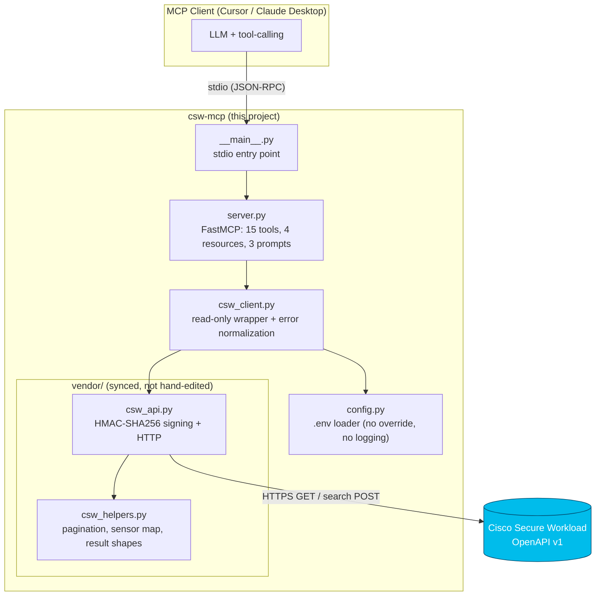
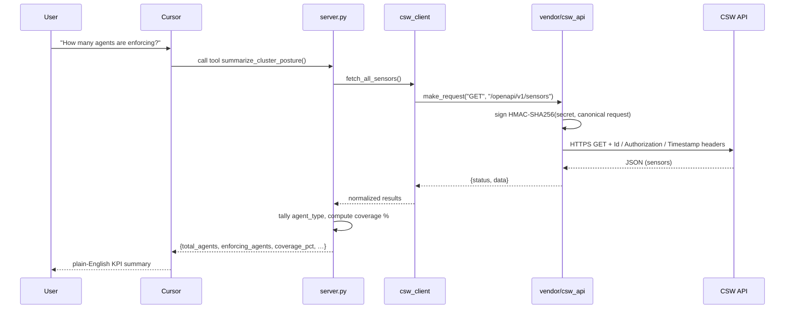

# Architecture

`csw-mcp` is a thin, read-only translation layer between an MCP client and the
Cisco Secure Workload OpenAPI. It is deliberately small.

## Component diagram



## Module responsibilities

| Module | Responsibility |
|--------|----------------|
| `__main__.py` | Starts the server on **stdio** transport. |
| `server.py` | Defines every tool, resource, and prompt. Validates/clamps inputs; projects outputs down to useful fields. Holds no credentials. |
| `csw_client.py` | The only module that talks to the cluster. Loads `.env` once, exposes read-only `get()` / `search()` helpers, and normalizes responses into `{count, results}` or a structured error. |
| `config.py` | Finds and loads a project `.env` into the environment (never overrides existing vars, never logs secrets). Reports missing required vars. |
| `vendor/csw_api.py` | Vendored HMAC-SHA256 request signer + HTTP client. **Do not hand-edit** — re-sync from `CSW_POV_Template`. |
| `vendor/csw_helpers.py` | Vendored pagination, sensor enumeration, and result-shape normalization. |

## Request lifecycle



## HMAC-SHA256 authentication (how the vendored client signs)

CSW's OpenAPI uses an HMAC digest scheme. For each request the vendored
`csw_api.py`:

1. Builds a **canonical message**:
   ```
   METHOD\n
   PATH (including query string)\n
   CHECKSUM (sha256 hex of body for POST/PUT with a body, else empty)\n
   application/json\n
   TIMESTAMP (ISO-8601 UTC, +0000)\n
   ```
2. Computes `HMAC-SHA256(api_secret, canonical_message)` and base64-encodes the
   raw digest.
3. Sends it with the request:
   - `Id`: the API key
   - `Authorization`: the base64 HMAC digest (no scheme prefix)
   - `Timestamp`: the exact timestamp used in the signature
   - `X-Tetration-Cksum`: the body checksum (only when a body is present)

Because the timestamp is part of the signed message, client/cluster clock skew
can cause 401s — see [TROUBLESHOOTING.md](TROUBLESHOOTING.md).

> `csw-mcp` only ever issues GET requests and read-only *search* POSTs
> (`/inventory/search`, `/flowsearch`). There is no code path that mutates the
> cluster.

## Why these choices

- **stdio only** eliminates the DNS-rebinding and CSRF risks of an HTTP listener
  and needs zero infrastructure.
- **Vendoring** the API client keeps the generic `CSW_POV_Template` as the single
  source of truth while letting this repo ship self-contained.
- **One cluster per process** (credentials from `.env`) keeps the MVP simple;
  multiple clusters = multiple installs.
