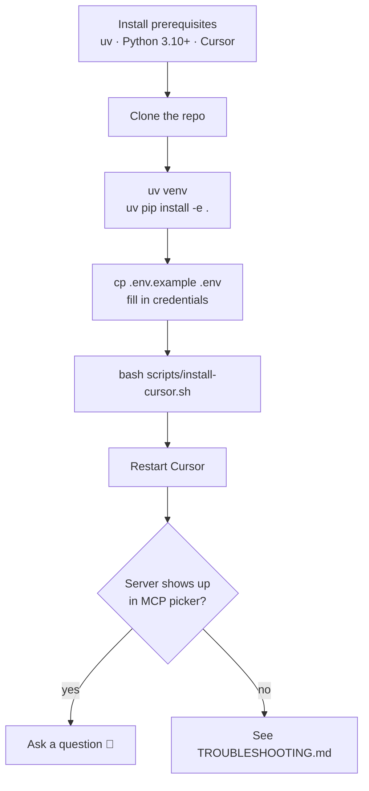

# Installing csw-mcp

A step-by-step guide to get `csw-mcp` running against your cluster in under 10
minutes.

## Install sequence



## 1. Prerequisites

| Tool | Why | Install |
|------|-----|---------|
| **uv** | Project toolchain (env + packaging) | `curl -LsSf https://astral.sh/uv/install.sh \| sh` |
| **Python 3.10+** | Runtime | uv can manage this for you |
| **Cursor** | MCP client (primary daily driver) | https://cursor.com |
| **CSW API key** | Cluster access | CSW UI → User Menu → API Keys |

Your API key needs these read capabilities:
`sensor_management`, `flow_inventory_query`, `app_policy_management`.

## 2. Clone

```bash
git clone https://github.com/chandrapati/csw-mcp.git
cd csw-mcp
```

## 3. Install

```bash
uv venv
uv pip install -e .
```

This creates `.venv/` and installs the `csw-mcp` console script.

## 4. Configure credentials

```bash
cp .env.example .env
```

Edit `.env`:

```bash
CSW_API_URL=https://your-cluster.tetrationcloud.com
CSW_API_KEY=<hex key from the CSW UI>
CSW_API_SECRET=<hex secret from the CSW UI>
# CSW_VERIFY_SSL=false   # only behind a TLS-inspecting corporate proxy
```

> `.env` is git-ignored. Never commit real credentials.

## 5. Wire it into Cursor

```bash
bash scripts/install-cursor.sh
```

This idempotently adds a `csw-mcp` entry to `~/.cursor/mcp.json`:

```json
{
  "mcpServers": {
    "csw-mcp": {
      "command": "uv",
      "args": ["run", "--directory", "/abs/path/to/csw-mcp", "csw-mcp"]
    }
  }
}
```

Restart Cursor (or reload MCP servers).

## 6. Verify

In a terminal:

```bash
uv run python -c "from csw_mcp.server import mcp; print('tools:', len(mcp._tool_manager._tools), 'prompts:', len(mcp._prompt_manager._prompts))"
# tools: 15 prompts: 3
```

In Cursor, the MCP picker should show `csw-mcp` with its tools:

```
┌─ MCP Servers ────────────────────────────┐
│  ● csw-mcp                      15 tools  │
│      list_scopes                          │
│      list_sensors                         │
│      summarize_cluster_posture            │
│      … (12 more)                          │
└───────────────────────────────────────────┘
```

Then ask:

> **"Summarize my CSW cluster posture."**

You should get a KPI summary (enforcing vs. visibility agents, coverage %, scope
count) — not raw JSON.

## Optional: live smoke test

Exercise every tool against your own cluster:

```bash
uv run python tests/test_tools_live.py
# PASS  list_scopes  …
# 15/15 tools returned without raising.
```

Having trouble? See **[TROUBLESHOOTING.md](TROUBLESHOOTING.md)**.
