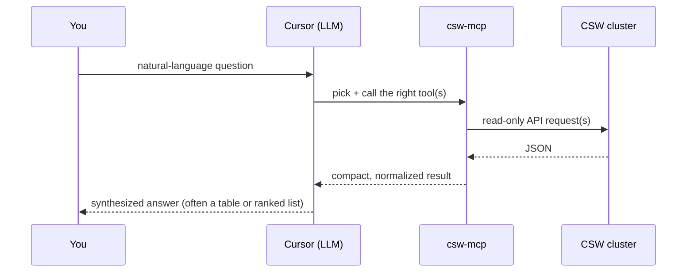

# Usage

How to actually *use* `csw-mcp` once it's wired into Cursor.

New to the product? The [README glossary](../README.md#new-to-cisco-secure-workload)
defines agent, scope, workspace, flow, and blast radius in plain language.
The longer learning path is
[CSW User Education](https://github.com/chandrapati/CSW-User-Education).

## How a tool call flows

You don't name tools — you ask questions. The model chooses tools, chains them,
and synthesizes an answer.

## 10 example prompts

1. *"Summarize my CSW cluster posture."* → `summarize_cluster_posture`
2. *"Which hosts aren't under enforcement? Rank the gaps."* → `summarize_cluster_posture` + `list_sensors`
3. *"Show me the workload at 198.51.100.21."* → `get_workload`
4. *"Which workloads run Windows?"* → `search_inventory` (field `os`)
5. *"What are my top 10 most vulnerable hosts?"* → `top_vulnerable_hosts`
6. *"List the critical CVEs on db-prod-01."* → `list_sensors` → `get_workload_cves`
7. *"Where is RDP or SMB exposed in the last 24 hours?"* → `top_risky_flows`
8. *"What policies apply to the jump host?"* → `list_sensors` → `list_policies_for_workload`
9. *"Show the ADM conversations for the Databases workspace."* → `list_workspaces` → `get_conversations`
10. *"What changed in our posture since last week?"* → `csw://snapshots/latest` + `summarize_cluster_posture`

## Using the built-in prompts

Three guided workflows ship as MCP prompts (pick them from Cursor's prompt menu):

| Prompt | Produces |
|--------|----------|
| `csw/triage-blast-radius` | Enforcement-gap analysis + 3 prioritized recommendations |
| `csw/weekly-posture-review` | A <200-word Monday posture delta |
| `csw/pov-closeout` | Executive narrative + KPI table + 30-day plan |

## When to use each tool

| If you want to… | Use |
|------------------|-----|
| Understand segmentation structure | `list_scopes`, `csw://scopes` |
| Inventory the agent fleet | `list_sensors` |
| Find specific workloads | `search_inventory`, `get_workload` |
| Gauge overall posture fast | `summarize_cluster_posture` |
| Inspect policy | `list_workspaces`, `get_workspace_policies`, `list_policies_for_workload` |
| Investigate traffic | `search_flows`, `get_conversations`, `top_risky_flows` |
| Assess vulnerabilities | `get_workload_cves`, `top_vulnerable_hosts`, `get_workload_packages` |
| Review detection config | `list_forensic_profiles`, `list_forensic_rules`, `list_forensic_intents` |
| Summarize recent traffic | `summarize_flows`, `long_lived_processes` |
| Audit policy for risky ports | `audit_risky_policy_ports` |

## Combining tools in one conversation

The real power is chaining. A typical blast-radius investigation:

1. `summarize_cluster_posture` → see coverage is low.
2. `list_sensors` → find which hosts are `VISIBILITY` (not enforcing).
3. `top_risky_flows` → see which risky ports those hosts expose.
4. `top_vulnerable_hosts` → cross-reference with CVE exposure.
5. Ask the model to rank the gaps and draft recommendations.

See [`examples/`](../examples/) for five complete, synthetic walkthroughs.

## Tips

- **Give the model IPs/hostnames** when you have them — it avoids a lookup round-trip.
- **Narrow time windows** on flow queries (`hours`) for faster, cheaper answers.
- **Aggregators are sampled/capped** — `top_risky_flows` reports `capped`, and
  `top_vulnerable_hosts` reports `scan_truncated`. Treat them as directional on
  very large clusters.
